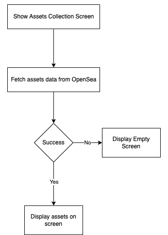
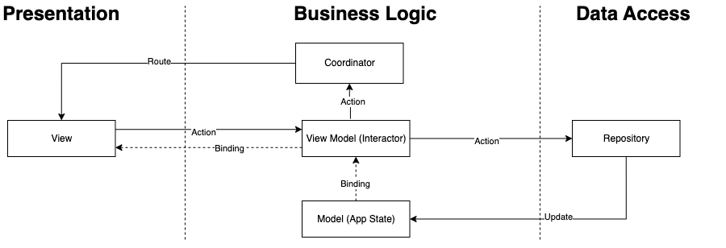
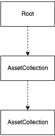

# nft-collection-pages
This project is to fetch the collections on an ethereum address using [OpenSea API](https://docs.opensea.io/reference#getting-assets) and display a collection list and respective detail information.

# Features
- [ ] Fetch NFT assets from OpenSea API https://api.opensea.io/api
- [x] Display a collection page using UIKit and RxSwift
- [x] Display the specific asset detail page using SwiftUI
- [x] Display the fetched ETH balance on the title of the collection list page

# Use Cases
- [x] Display a collection page and scroll down to load more content

https://user-images.githubusercontent.com/1248888/221095418-6a4c2ba9-2a25-44ec-b26d-8e368041d27d.mp4

- [x] Tap an asset item in the collection page to navigate to the specific asset detail page and open the marketplace link

https://user-images.githubusercontent.com/1248888/221095449-868b75f8-9c81-422c-b22d-96ba3ec87966.mp4

# Flowchart


# Payload Contract
```
GET /v1/assets

Query Parameters:
format (string): The format of response: json
owner (string): The address of the owner of the assets
limit (string): Limit. Defaults to 20, capped at 200.
cursor (string): A cursor pointing to the page to retrieve

200 RESPONSE
{
  "assets": [
    {
      "image_url": An image for the item. Note that this is the cached URL we store on our end. The original image url is image_original_url,
      "name": Name of the item,
      "collection": {
        "name": Name of the collection,
        ...
      },
      "description": Description of the item,
      "permalink": The item link to the OpenSea marketplace,
      ...
    }
  ],
  "next": a cursor pointing to the next page,
  "previous: a cursor pointing to the previous page
}
```

# Model Spec
## Asset
| Property | Type |
| ----- | ----- |
| id | Int |
| imageUrl | String |
| name | String |
| description | String |
| permanentlink | String |

# App Architecture
This projecct adopts the MVVM-C pattern for presentation and navigation and the repository pattern for fetching remote data.



# State Management
Coordinators manage app states (models) in a tree.


